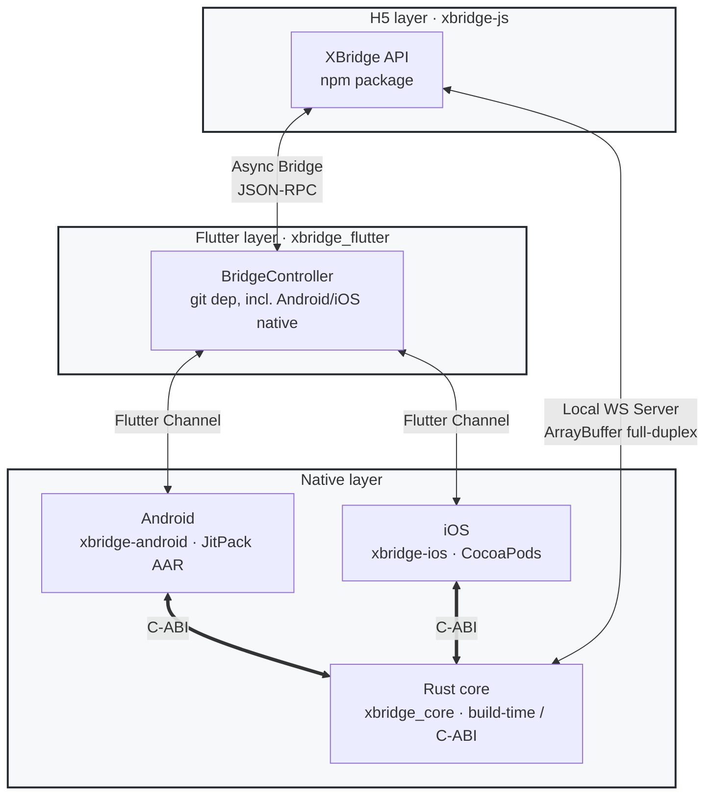

# XBridge

**English** | [简体中文](README_ZH.md)

A generic, open-source, business-free cross-platform bridge SDK — one protocol across **H5 / Flutter / Native**, with each layer usable independently and no hard dependency on the others.

[](https://github.com/3kaiu/xbridge/actions/workflows/js.yml)
[](https://github.com/3kaiu/xbridge/actions/workflows/flutter.yml)
[](https://github.com/3kaiu/xbridge/actions/workflows/rust.yml)
[](https://github.com/3kaiu/xbridge/actions/workflows/native-sync-check.yml)
[](#license)

## Features

- **Independent layers** — H5 / Flutter / Native each integrate on their own; degraded automatically when no bridge is present (`use it when available, treat as no-bridge otherwise`).
- **Pure async JSON-RPC** — unified as a strictly async protocol since v0.1.4; the sync bypass channel has been removed.
- **Self-healing availability** — a probe detects a broken `postMessage` environment and automatically recalls once injection lands (v0.1.5).
- **High-volume media passthrough** — local WebSocket, full-duplex, zero-serialization, for ArrayBuffer streams.
- **Defense in depth** — origin allowlist validation; the native layer and its Flutter copy stay **byte-identical** (single source of truth), preventing security logic drift across the three platforms.

## Quick Start

### H5 — npm

```bash
pnpm add @3kaiu/xbridge-js
```

```typescript
import { XBridge } from '@3kaiu/xbridge-js'
const bridge = new XBridge()
const token = await bridge.call('getToken')        // common: wait for readiness before calling
```

If the H5 page runs before the bridge is injected (prerender / first-frame race), wait with `ready()`:

```typescript
try {
  await bridge.ready()                             // resolve = ready; rejects on timeout / no bridge
  const safeArea = await bridge.call('getSafeArea')
} catch { /* not an App container or timeout → fallback */ }
```

### Flutter — git dependency

```yaml
# pubspec.yaml
dependencies:
  xbridge_flutter:
    git: { url: https://github.com/3kaiu/xbridge.git, path: packages/xbridge_flutter, ref: v0.1.5 }
```

```dart
final bridge = BridgeController()..attachWebViewController(controller);
bridge.addHandler('getToken', (ctx, params) => sessionService.token);   // register an H5 call
```

Android / iOS native code ships with the Flutter plugin automatically — zero config.

### Android — JitPack

```groovy
implementation 'com.github.3kaiu.xbridge:xbridge-core:v0.1.5'
```

Standalone consumers use its security / fallback capabilities (the WebView-mounting `XBridgeSyncInterface` was removed in 0.1.4):

```kotlin
val nativeBridge = XBridgeNativeBridge()          // Native → H5 outbound call (fallback)
val policy = XBridgeSecurityPolicy.allowlist(setOf("https://app.example.com"))
```

### iOS — CocoaPods

```ruby
pod 'XBridgeiOS/Core', :git => 'https://github.com/3kaiu/xbridge.git', :tag => 'v0.1.5'
```

```swift
let nativeBridge = XBridgeNativeBridge()
let policy = XBridgeSecurityPolicy.allowlist(["https://app.example.com"])
```

### Rust — build-time dependency

Built from source by the native layer (`rust/xbridge_core`), or consumed via CI-prebuilt binaries; not published to any registry.

## Architecture



### Channels

| Channel | Purpose | Characteristics |
| --- | --- | --- |
| Async Bridge | Regular JSON-RPC request/response | Across Flutter Channel, strictly async |
| Local WS Server | High-volume media streams | H5 ↔ local WS, ArrayBuffer full-duplex, zero serialization |

## Package Matrix

| Package | Distribution | Depends on Flutter? |
| --- | --- | --- |
| xbridge-js | npm | ❌ |
| xbridge_flutter | git dependency | ✅ |
| xbridge_protocol | git dependency (pure Dart) | ❌ |
| xbridge_platform_interface | git dependency | ✅ |
| xbridge-android | JitPack | ❌ (Core) / ✅ (Flutter) |
| xbridge-ios | CocoaPods | ❌ (Core) / ✅ (Flutter) |
| xbridge_core | build-time source / prebuilt binary | ❌ |

Source lives in `packages/` (Flutter / Android / iOS / JS) and `rust/xbridge_core`.

## Contributing

**Single source of truth (please read)**: Android / iOS native logic is modified only at `packages/xbridge-android` / `packages/xbridge-ios`, then synced to the Flutter copy with `scripts/sync_native_to_flutter.sh`. CI runs `--check` on every PR / push to verify the copy is **byte-identical** to the source; any drift is rejected. This is why security logic stays consistent across all three platforms (two independent copies once caused a build failure and interface mismatch).

```bash
# JS
cd packages/xbridge-js && npm install && npm run build
# Flutter
cd packages/xbridge_flutter && flutter pub get && dart analyze
# Rust
cd rust/xbridge_core && cargo test
# Android
cd packages/xbridge-android && ./gradlew :xbridge-core:build
# iOS (requires pod install + xcodebuild)
```

## Releasing

Pushing a `v*` tag triggers automated releases via GitHub Actions (the latest tag is the single source of truth for the version, bumped uniformly with `scripts/version.sh`):

```bash
git tag v0.1.5
git push origin v0.1.5
```

- npm auto-publishes; JitPack auto-builds the AAR; a GitHub Release with install instructions is auto-created.

## License

MIT