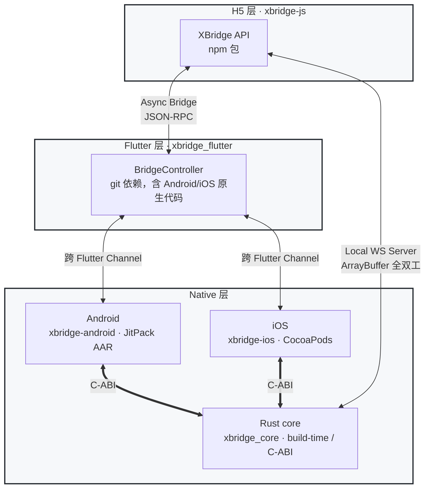

# XBridge

[English](README.md) | **简体中文**

通用、开源、零业务耦合的跨端桥接 SDK —— 一套协议跑通 **H5 / Flutter / Native**，三层各自独立可用，不强制依赖其他层。

[](https://github.com/3kaiu/xbridge/actions/workflows/js.yml)
[](https://github.com/3kaiu/xbridge/actions/workflows/flutter.yml)
[](https://github.com/3kaiu/xbridge/actions/workflows/rust.yml)
[](https://github.com/3kaiu/xbridge/actions/workflows/native-sync-check.yml)
[](#许可)

## 特性

- **三层独立** —— H5 / Flutter / Native 各自可单独接入；无桥环境自动降级（`可用才用，不可用当无桥`）。
- **纯异步 JSON-RPC** —— v0.1.4 起统一为绝对异步协议，同步旁路通道已移除。
- **可用性自愈** —— 探针检测 `postMessage` 坏环境，注入后自动重连（v0.1.5）。
- **大体积多媒体直通** —— 本地 WebSocket 全双工、零序列化，支撑 ArrayBuffer 流。
- **纵深安全** —— origin allowlist 校验；原生层与 Flutter 副本保持**逐字节一致**（单一事实源），杜绝三端安全逻辑漂移。

## 快速开始

### H5 — npm

```bash
pnpm add @3kaiu/xbridge-js
```

```typescript
import { XBridge } from '@3kaiu/xbridge-js'
const bridge = new XBridge()
const token = await bridge.call('getToken')        // 常用：等就绪后再调用
```

若 H5 先于桥注入执行（预渲染 / 首屏抢跑），用 `ready()` 等待；

```typescript
try {
  await bridge.ready()                             // resolve = 就绪；超时/无桥 reject
  const safeArea = await bridge.call('getSafeArea')
} catch { /* 非 App 容器或超时 → fallback */ }
```

### Flutter — git 依赖

```yaml
# pubspec.yaml
dependencies:
  xbridge_flutter:
    git: { url: https://github.com/3kaiu/xbridge.git, path: packages/xbridge_flutter, ref: v0.1.5 }
```

```dart
final bridge = BridgeController()..attachWebViewController(controller);
bridge.addHandler('getToken', (ctx, params) => sessionService.token);   // 注册 H5 调用
```

Android / iOS 原生代码随 Flutter plugin 自动包含，零配置。

### Android — JitPack

```groovy
implementation 'com.github.3kaiu.xbridge:xbridge-core:v0.1.5'
```

独立消费方使用其安全 / fallback 能力（WebView 挂载的 `XBridgeSyncInterface` 已于 0.1.4 移除）：

```kotlin
val nativeBridge = XBridgeNativeBridge()          // Native → H5 主动调用（fallback）
val policy = XBridgeSecurityPolicy.allowlist(setOf("https://app.example.com"))
```

### iOS — CocoaPods

```ruby
pod 'XBridgeiOS/Core', :git => 'https://github.com/3kaiu/xbridge.git', :tag => 'v0.1.5'
```

```swift
let nativeBridge = XBridgeNativeBridge()
let policy = XBridgeSecurityPolicy.allowlist(["https://app.example.com"])
```

### Rust — build-time 依赖

由原生层从源码构建（`rust/xbridge_core`），或使用 CI 预编译二进制；不发布到 registry。

## 架构



### 通道

| 通道 | 用途 | 特性 |
| --- | --- | --- |
| Async Bridge | 常规 JSON-RPC 请求-响应 | 跨 Flutter Channel，绝对异步 |
| Local WS Server | 大体积多媒体流 | H5 ↔ 本地 WS，ArrayBuffer 全双工，零序列化 |

## 包矩阵

| 包 | 分发方式 | 依赖 Flutter？ |
| --- | --- | --- |
| xbridge-js | npm | ❌ |
| xbridge_flutter | git 依赖 | ✅ |
| xbridge_protocol | git 依赖（纯 Dart） | ❌ |
| xbridge_platform_interface | git 依赖 | ✅ |
| xbridge-android | JitPack | ❌ (Core) / ✅ (Flutter) |
| xbridge-ios | CocoaPods | ❌ (Core) / ✅ (Flutter) |
| xbridge_core | build-time 源码 / 预编译二进制 | ❌ |

源码位于 `packages/`（Flutter / Android / iOS / JS）与 `rust/xbridge_core`。

## 贡献

**单一事实源约定（务必阅读）**：Android / iOS 原生逻辑以 `packages/xbridge-android` / `packages/xbridge-ios` 为唯一修改点，并用 `scripts/sync_native_to_flutter.sh` 同步到 Flutter 副本。CI 用 `--check` 模式在每次 PR / push 校验副本与源**逐字节一致**，漂移即拦截。这正是三端安全逻辑保持一致的原因（历史上曾因两处各自演进导致过一次构建失败与接口不一致）。

```bash
# JS
cd packages/xbridge-js && npm install && npm run build
# Flutter
cd packages/xbridge_flutter && flutter pub get && dart analyze
# Rust
cd rust/xbridge_core && cargo test
# Android
cd packages/xbridge-android && ./gradlew :xbridge-core:build
# iOS（需 pod install + xcodebuild）
```

## 发布

推送 `v*` tag 触发 GitHub Actions 自动发布（version 以最新 tag 为单一事实源，用 `scripts/version.sh` 统一 bump）：

```bash
git tag v0.1.5
git push origin v0.1.5
```

- npm 自动 publish；JitPack 自动构建 AAR；GitHub Release 自动创建，带安装说明。

## 许可

MIT